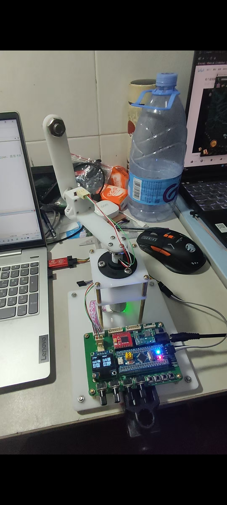

# 基于STM32的一阶倒立摆
>本项目基于**江协科技**开源学习
>
>原项目地址：[倒立摆](https://www.bilibili.com/video/BV1G9zdYQEr3/?spm_id_from=333.337.search-card.all.click&vd_source=95764cfd8bb1371dc92f356cd7f2fb75)
>
>在此感谢原项目作者的杰出工作

## 项目预览

>再次感谢原项目作者的杰出工作
>
>同时也欢迎大家一起来学习
>
***
后面会继续更新，请等待...
