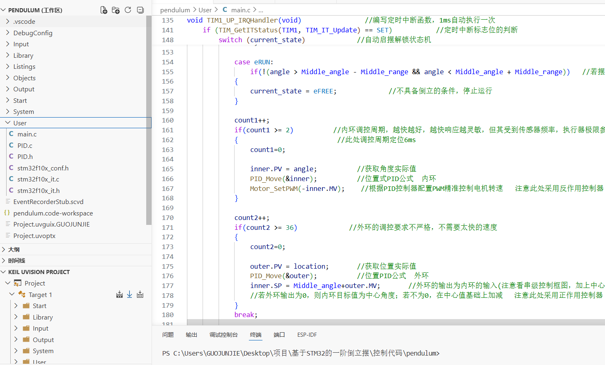
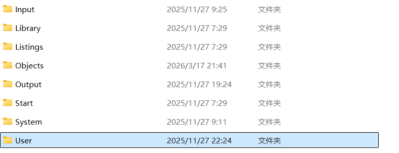
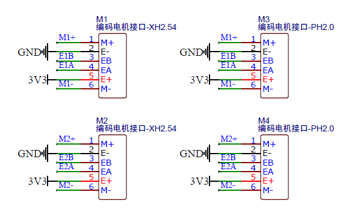
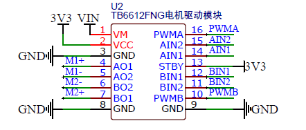
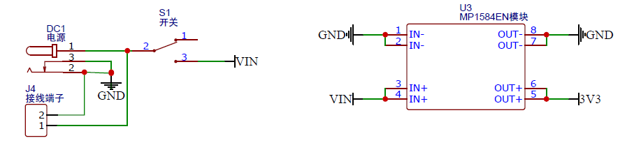

# 基于STM32的一阶倒立摆
>本项目基于**江协科技**开源学习
>
>原项目地址：[倒立摆](https://www.bilibili.com/video/BV1G9zdYQEr3/?spm_id_from=333.337.search-card.all.click&vd_source=95764cfd8bb1371dc92f356cd7f2fb75)
>
>在此感谢原项目作者的杰出工作

## 项目预览

[跳转项目演示视频](https://www.bilibili.com/video/BV1z5wtzeEoM/?vd_source=95764cfd8bb1371dc92f356cd7f2fb75)

## 项目功能


## 项目职责
* 编写**编码电机**驱动模块，通过TB6612电机驱动模块实现
* 编写**编码器**驱动模块，实现对直流减速电机速度和位置的测量
* 编写**角度传感器**驱动模块，实现对摆杆的实时角度测量
* 编写**显示任务**驱动模块，通过OLED实时显示pid参数和横杆位置，摆杆角度等数据，通过LED显示当前状态
* 编写**按键**驱动模块，通过按键交互完成倒立摆启摆以及其它功能
* 编写**串级PID控制系统**模块代码，外环位置内环角度，PID参数整定，使得倒立摆能够抵抗外部干扰
* 编写**自动启摆状态机**函数，通过共振启摆的方式实现倒立摆自动启摆
***

## 关于软件架构
本项目控制核心采用STM32F103C8T6，基于标准库开发，移植标准库文件Library，Keil+Vscode编译程序

优点在于标准库简单便捷，内含STM32标准外设的API函数，调用容易。使用Vscode作为编辑器，可以用到AI插件，帮助代码补全，并且将文件放到工作区，方便编辑；而Keil则可以用来快速编译调试，使用Debug功能设置断点方便调试代码，串口调试工具以及波形调试工具用到的是VOFA;
### 开发环境

### 软件

其中Input为输入层，放置常用传感器的底层驱动代码，包括角度传感器，编码器等

Library为库函数，可以方便移植和使用多个STM32外设标准库函数，代码集成方便编写

Output为输出层，放置多个执行器的底层驱动代码，包括直流减速电机，OLED屏和LED等

Start为启动层，放置必不可少的STM32启动文件

System为核心层，放置USART/IIC/ADC/TIM等常用通信协议驱动

User为用户层，编写主函数和PID控制系统
***
## 关于电机驱动任务



当前编码电机接的是M3接口，其中M1+和M1-就是直流电机接口的两个引脚，分别接在TB6612模块的A01和AO2，作为A路的输出

A路的控制引脚是PWMA，AIN1和AIN2，其中，PWMA接的是A0引脚，只需要再A0输出PWM波形即可，查看引脚复用表得知A0复用了TIM2的通道1

其中AIN1和AIN2接在了PB12和PB13，用GPIO控制电机的方向



VM为电机驱动电源，经过电源或接线端子过一个开关到VIN，输入电压为5-12V用于驱动电机，而后VIN电源通过稳压模块，降到3.3V，用于给到后面所有的低压设备供电
```
TIM_InternalClockConfig(TIM2);                     //选择内部时钟为时基单元的时钟源
	
	TIM_TimeBaseInitTypeDef TIM_TimeBase_Structure;
	TIM_TimeBase_Structure.TIM_ClockDivision=TIM_CKD_DIV1;         //选择1时钟分频
	TIM_TimeBase_Structure.TIM_CounterMode=TIM_CounterMode_Up;      //选择向上计数模式
	TIM_TimeBase_Structure.TIM_Period=100-1;                                //选择ARR自动重装器值100-1
	TIM_TimeBase_Structure.TIM_Prescaler=36-1;                               //选择PSC预分频器值720-1
	TIM_TimeBase_Structure.TIM_RepetitionCounter=0;                       //选择重复计数器值0，高级定时器才需要用这个
	TIM_TimeBaseInit(TIM2,&TIM_TimeBase_Structure);           //初始化时基单元
	
	TIM_OCInitTypeDef TIM_OCInitStruct;
	TIM_OCStructInit(&TIM_OCInitStruct);       //没有用完结构体成员，给结构体变量赋初值
	TIM_OCInitStruct.TIM_OCMode=TIM_OCMode_PWM1;         //设置为PWM模式1
	TIM_OCInitStruct.TIM_OCPolarity=TIM_OCPolarity_High;    //极性不翻转
	TIM_OCInitStruct.TIM_OutputState=TIM_OutputState_Enable;    //输出状态使能
	TIM_OCInitStruct.TIM_Pulse=0;                                //设置CCR寄存器值                       
	                                       //带N的成员是高级定时器使用的，这里不需要          
	TIM_OC1Init(TIM2,&TIM_OCInitStruct);                //初始化输出比较单元通道2        
	                                                 //同一个定时器不同通道的频率一样，各自的占空比由各自的CCR决定，相位也是同步的
	
	TIM_Cmd(TIM2,ENABLE);               //使能定时器
```
***

## 关于编码器驱动任务


我们使用的是M3电机，其中E1B和E1A是编码器的两个引脚网络编号，对应接在了STM32的PA6和PA7两个引脚

查看引脚功能复用表发现PA6和PA7分别对应TIM3的通道1和通道2
```
	TIM_TimeBaseInitTypeDef TIM_TimeBaseInitStructure;                    
	TIM_TimeBaseInitStructure.TIM_ClockDivision = TIM_CKD_DIV1;         //选择1时钟分频
	TIM_TimeBaseInitStructure.TIM_CounterMode = TIM_CounterMode_Up;     //选择向上计数模式
	TIM_TimeBaseInitStructure.TIM_Period = 65536 - 1;		  //ARR
	TIM_TimeBaseInitStructure.TIM_Prescaler = 1 - 1;		  //PSC
	TIM_TimeBaseInitStructure.TIM_RepetitionCounter = 0;           //选择重复计数器值0，高级定时器才需要用这个
	
	TIM_TimeBaseInit(TIM3, &TIM_TimeBaseInitStructure);        //初始化时基单元
```
编码器读取函数定时获取编码器增量，即表示速度，而位置就是增量值的累加
```
int16_t Encoder_Get(void)
{
	int16_t Temp;
	Temp = TIM_GetCounter(TIM3);
	TIM_SetCounter(TIM3, 0);
	return Temp;
}
if (TIM_GetITStatus(TIM1, TIM_IT_Update) == SET)           //定时中断标志位的判断
	{
		Count++;
		if(Count>=40)            //定时器分频
		{
			Count=0;
			Speed=Encoder_Get();         //获取横摆速度
			location+=Encoder_Get();     //获取横摆位置
		}
	}
```
***


>再次感谢原项目作者的杰出工作
>
>同时也欢迎大家一起来学习
>
***
后面会继续更新，请等待...
