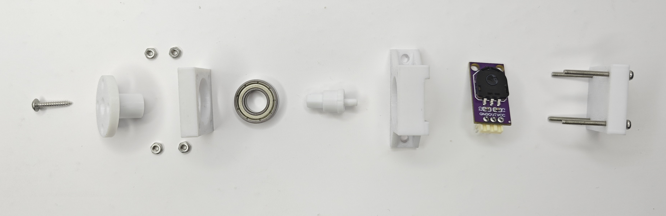
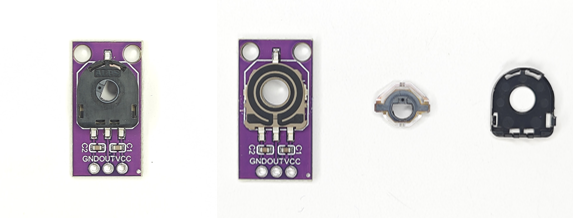
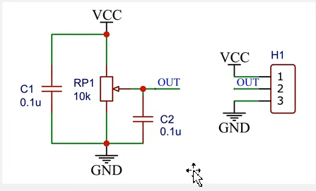

# 基于STM32的一阶倒立摆
>本项目基于**江协科技**开源学习
>
>原项目地址：[倒立摆](https://www.bilibili.com/video/BV1G9zdYQEr3/?spm_id_from=333.337.search-card.all.click&vd_source=95764cfd8bb1371dc92f356cd7f2fb75)
>
>在此感谢原项目作者的杰出工作

## 项目预览

[跳转项目演示视频](https://www.bilibili.com/video/BV1z5wtzeEoM/?vd_source=95764cfd8bb1371dc92f356cd7f2fb75)

## 项目功能
⚙️ 自动启摆与稳定控制
设计共振启摆状态机，通过周期性摆动横杆逐步建立摆杆能量，实现从下垂状态自动起摆并快速进入直立平衡；起摆后由串级PID控制器维持摆杆稳定，角度始终维持在90°±1°以内。

🎯 串级PID精确调节
采用外环位置‑内环角度的串级PID结构，外环根据横杆位置偏差计算期望角度，内环快速响应角度偏差并输出PWM控制电机，使倒立摆能在目标位置精确平衡，有效抑制外界扰动。

📏 高精度传感器融合
使用电位器（ADC） 实时采集摆杆角度，分辨率高、响应快；编码器（TIM）测量电机转速与横杆位移，数据经滤波后用于位置环计算，确保控制系统稳定可靠。

🕹️ 一键交互与实时监控
通过按键完成启摆、复位、参数切换等操作；OLED屏幕实时显示当前PID参数、横杆位置、摆杆角度及系统状态，便于调试与演示。

⚡ 强抗干扰能力
经过PID参数整定（先比例后积分微分），系统对外部冲击（如轻推摆杆）具备快速恢复能力，摆杆偏离后能迅速回归垂直，稳态误差小。

## 项目职责
* 编写**编码电机**驱动模块，通过TB6612电机驱动模块实现
* 编写**编码器**驱动模块，实现对直流减速电机速度和位置的测量
* 编写**角度传感器**驱动模块，实现对摆杆的实时角度测量
* 编写**显示任务**驱动模块，通过OLED实时显示pid参数和横杆位置，摆杆角度等数据，通过LED显示当前状态
* 编写**按键**驱动模块，通过按键交互完成倒立摆启摆以及其它功能
* 编写**串级PID控制系统**模块代码，外环位置内环角度，PID参数整定，使得倒立摆能够抵抗外部干扰
* 编写**自动启摆状态机**函数，通过共振启摆的方式实现倒立摆自动启摆
***

## 关于软件架构
本项目控制核心采用STM32F103C8T6，基于标准库开发，移植标准库文件Library，Keil+Vscode编译程序

优点在于标准库简单便捷，内含STM32标准外设的API函数，调用容易。使用Vscode作为编辑器，可以用到AI插件，帮助代码补全，并且将文件放到工作区，方便编辑；而Keil则可以用来快速编译调试，使用Debug功能设置断点方便调试代码，串口调试工具以及波形调试工具用到的是VOFA;
### 开发环境

### 软件

其中Input为输入层，放置常用传感器的底层驱动代码，包括角度传感器，编码器等

Library为库函数，可以方便移植和使用多个STM32外设标准库函数，代码集成方便编写

Output为输出层，放置多个执行器的底层驱动代码，包括直流减速电机，OLED屏和LED等

Start为启动层，放置必不可少的STM32启动文件

System为核心层，放置USART/IIC/ADC/TIM等常用通信协议驱动

User为用户层，编写主函数和PID控制系统
***
## 关于电机驱动任务


当前编码电机接的是M3接口，其中M1+和M1-就是直流电机接口的两个引脚，分别接在TB6612模块的A01和AO2，作为A路的输出

A路的控制引脚是PWMA，AIN1和AIN2，其中，PWMA接的是A0引脚，只需要再A0输出PWM波形即可，查看引脚复用表得知A0复用了TIM2的通道1

其中AIN1和AIN2接在了PB12和PB13，用GPIO控制电机的方向


VM为电机驱动电源，经过电源或接线端子过一个开关到VIN，输入电压为5-12V用于驱动电机，而后VIN电源通过稳压模块，降到3.3V，用于给到后面所有的低压设备供电
```
TIM_InternalClockConfig(TIM2);                     //选择内部时钟为时基单元的时钟源
	
	TIM_TimeBaseInitTypeDef TIM_TimeBase_Structure;
	TIM_TimeBase_Structure.TIM_ClockDivision=TIM_CKD_DIV1;         //选择1时钟分频
	TIM_TimeBase_Structure.TIM_CounterMode=TIM_CounterMode_Up;      //选择向上计数模式
	TIM_TimeBase_Structure.TIM_Period=100-1;                                //选择ARR自动重装器值100-1
	TIM_TimeBase_Structure.TIM_Prescaler=36-1;                               //选择PSC预分频器值720-1
	TIM_TimeBase_Structure.TIM_RepetitionCounter=0;                       //选择重复计数器值0，高级定时器才需要用这个
	TIM_TimeBaseInit(TIM2,&TIM_TimeBase_Structure);           //初始化时基单元
	
	TIM_OCInitTypeDef TIM_OCInitStruct;
	TIM_OCStructInit(&TIM_OCInitStruct);       //没有用完结构体成员，给结构体变量赋初值
	TIM_OCInitStruct.TIM_OCMode=TIM_OCMode_PWM1;         //设置为PWM模式1
	TIM_OCInitStruct.TIM_OCPolarity=TIM_OCPolarity_High;    //极性不翻转
	TIM_OCInitStruct.TIM_OutputState=TIM_OutputState_Enable;    //输出状态使能
	TIM_OCInitStruct.TIM_Pulse=0;                                //设置CCR寄存器值                       
	                                       //带N的成员是高级定时器使用的，这里不需要          
	TIM_OC1Init(TIM2,&TIM_OCInitStruct);                //初始化输出比较单元通道2        
	                                                 //同一个定时器不同通道的频率一样，各自的占空比由各自的CCR决定，相位也是同步的
	
	TIM_Cmd(TIM2,ENABLE);               //使能定时器
```
***

## 关于编码器驱动任务


我们使用的是M3电机，其中E1B和E1A是编码器的两个引脚网络编号，对应接在了STM32的PA6和PA7两个引脚

查看引脚功能复用表发现PA6和PA7分别对应TIM3的通道1和通道2
```
	TIM_TimeBaseInitTypeDef TIM_TimeBaseInitStructure;                    
	TIM_TimeBaseInitStructure.TIM_ClockDivision = TIM_CKD_DIV1;         //选择1时钟分频
	TIM_TimeBaseInitStructure.TIM_CounterMode = TIM_CounterMode_Up;     //选择向上计数模式
	TIM_TimeBaseInitStructure.TIM_Period = 65536 - 1;		  //ARR
	TIM_TimeBaseInitStructure.TIM_Prescaler = 1 - 1;		  //PSC
	TIM_TimeBaseInitStructure.TIM_RepetitionCounter = 0;           //选择重复计数器值0，高级定时器才需要用这个
	
	TIM_TimeBaseInit(TIM3, &TIM_TimeBaseInitStructure);        //初始化时基单元
```
编码器读取函数定时获取编码器增量，即表示速度，而位置就是增量值的累加
```
int16_t Encoder_Get(void)
{
	int16_t Temp;
	Temp = TIM_GetCounter(TIM3);
	TIM_SetCounter(TIM3, 0);
	return Temp;
}
if (TIM_GetITStatus(TIM1, TIM_IT_Update) == SET)           //定时中断标志位的判断
	{
		Count++;
		if(Count>=40)            //定时器分频
		{
			Count=0;
			Speed=Encoder_Get();         //获取横摆速度
			location+=Encoder_Get();     //获取横摆位置
		}
	}
```
***

## 关于角度传感器驱动模块



此处，我们选用弧形电位器测量方案，简单分辨率高，且测量的频率快；但是电位器一般有盲区，并不能360度无死角的测量，


其中RP1为角度传感器，即电位器(滑动电阻)，C1和C2为两个滤波电容，C1为电源滤波，C2为输出信号滤波

OUT引脚接入STM32，用ADC转换为电压值，需要注意的是，在摆杆进入盲区后，测量的AD值是无意义的，AD引脚悬空，由于有C2电容的存在，AD进入盲区后会维持进入盲区之前的值，同时电容缓慢放电，AD值会逐渐向2048靠近
```
ADC_RegularChannelConfig(ADC1,ADC_Channel_8,1,ADC_SampleTime_55Cycles5);       //配置规则组通道设置，通道0，序列1，转换时间适中
	
	ADC_InitTypeDef ADC_InitStructure;
	ADC_InitStructure.ADC_ContinuousConvMode=DISABLE;             //选择单次转换模式
	ADC_InitStructure.ADC_DataAlign=ADC_DataAlign_Right;        //选择右对齐方式
	ADC_InitStructure.ADC_ExternalTrigConv=ADC_ExternalTrigConv_None;     //外部触发方式选择软件触发
	ADC_InitStructure.ADC_Mode=ADC_Mode_Independent;           //配置ADC工作模式为独立工作模式
	ADC_InitStructure.ADC_NbrOfChannel=1;                       //通道数目为1
	ADC_InitStructure.ADC_ScanConvMode=DISABLE;                //选择非扫描模式
	
	ADC_Init(ADC1,&ADC_InitStructure);                  //初始化ADC
```
在配置好ADC各个模式后，初始化成功，校准之后，可以启动AD转换，调用结果
```
uint16_t AD_GetValue(void)                   //启动转换，调用结果
{
	ADC_SoftwareStartConvCmd(ADC1,ENABLE);         //软件方式触发转换
	
	while(ADC_GetFlagStatus(ADC1,ADC_FLAG_EOC)==RESET);          //等待，返回ADC状态标志位EOC为1可开始下一步
	
	return ADC_GetConversionValue(ADC1);                  //返回 ADC获取转换值
}
```
***

## 关于串级PID控制系统模块代码的编写
项目设计的串级PID控制系统，外环位置环内环角度环


```
void PID_Move(PID *p)          //定义PID启动代码
{
	p->Error1 = p->Error0;           //上次误差
	p->Error0 = p->SP - p->PV;       //本次误差
	
	if(fabs(p->Ki)> EPSILON)         //判断Ki非0
	{
		p->ErrorInt += p->Error0;     //误差积分	
	}
	else
		p->ErrorInt = 0;              //防止积分饱和
	
	p->MV = p->Kp * p->Error0 + p->Ki * p->ErrorInt + p->Kd * (p->Error0 - p->Error1);      //位置式PID计算公式
	
	if(p->MV > p->MVmax){p->MV =p->MVmax;}
	else if(p->MV < p->MVmin){p->MV = p->MVmin;}            //输出限幅
	
}
```
串级PID先内环测试后外环测试，注意控制器输出的正反方向可以通过不断测试得出结论
```
count1++;
			if(count1 >= 2)          //内环调控周期，越快越好，越快响应越灵敏，但其受到传感器频率，执行器极限参数的限制，超过限制没有意义
			{                         //此处调控周期定位6ms
				count1=0;
				
				inner.PV = angle;          //获取角度实际值 
				PID_Move(&inner);          //位置式PID公式  内环
				Motor_SetPWM(-inner.MV);    //根据PID控制器配置PWM精准控制电机转速   注意此处采用反作用控制器
			}
			
			count2++;
			if(count2 >= 36)             //外环的调控要求不严格，不需要太快的速度
			{
				count2=0;
				
				outer.PV = location;       //获取位置实际值
				PID_Move(&outer);          //位置PID公式  外环
				inner.SP = Middle_angle+outer.MV;       //外环的输出为内环的输入(注意看串级控制框图，加上中心角度)
				//若外环输出为0，则内环目标值为中心角度；若不为0，在中心值基础上加减   注意此处采用正作用控制器
			}
```

参数整定一般先确定Kp，后Ki，最后是Kd；
调参数，给阶跃，看波形

PID参数数量级确定：
三个参数的数量级，一般由输出范围和输入范围的比值确定；
即MV的范围除以SP得到； 

PID极性判断：(正反控制器的选择)
控制器正反作用选择正确，执行器进行调节，若选择错误，执行器往相反方向运动，调节出现问题；
实测法：
先将Kp,Ki,Kd置0，将PV调节到SP附近，给一点点Kp,也就是给PID启动一点，手动调节PV与SP偏移，观察执行器输出方向，是否有调节SP与PV相近，没有调节则极性相反

纯比例项控制：
随着Kp的增大，P调节作用增强，稳态误差减小。当Kp非常大时候，系统趋于不稳定，且稳态误差仍无法消除

引入积分项：
先将Kp调到系统稳定临界时，此时存在稳态误差；
随着Ki的增大，PI调节作用累加，稳态误差消除；

是否要加Kd项：
给阶跃后，如果PV靠近SP的趋势放缓，呈逐渐收敛，慢慢贴合的趋势，可以不用加入Kd；
如果PV靠近SP时，变化迅猛，呈一头扎向目标的趋势，或者靠近目标时，变化曲线没有放缓，需要加入Kd防止超调；
Kd的作用是增加阻尼，防止系统超调，增加系统稳定性；
但是阻尼过大，会出现提前波动，不稳定情况


>再次感谢原项目作者的杰出工作
>
>同时也欢迎大家一起来学习
>
***
后面会继续更新，请等待...
